# Edugram

Edugram is a responsive Flutter + Firebase social app with posts, stories, messaging, activity feeds, profile pages, and light/dark mode support. It runs on Android, iOS, and Web.

## Project Overview
- App name: Edugram
- Framework: Flutter
- Backend: Firebase Authentication, Cloud Firestore, Firebase Storage
- Platforms: Android, iOS, Web, and desktop-supported Flutter targets

## Features
- Responsive mobile and web layouts
- Email and password authentication
- Light mode and dark mode UI
- Create and browse posts
- Create and view stories
- Like and comment on posts
- Search users and explore content
- Follow users and view activity updates
- Direct messages and chat screens
- Profile pages with posts, followers, and following
- Firebase-backed real-time app experience

## Screenshots

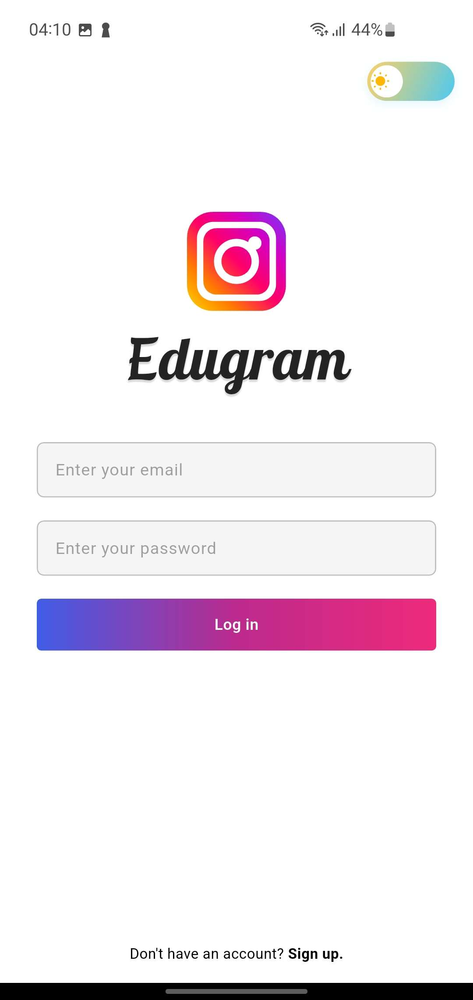&nbsp;
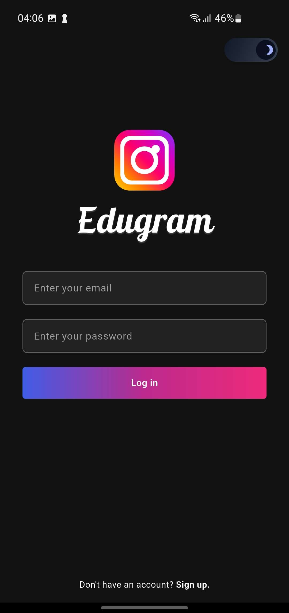&nbsp;
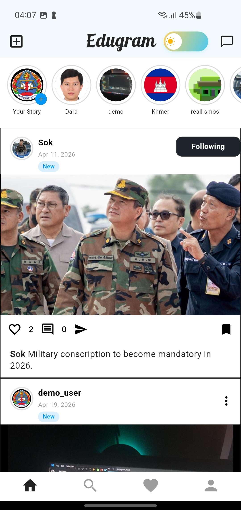

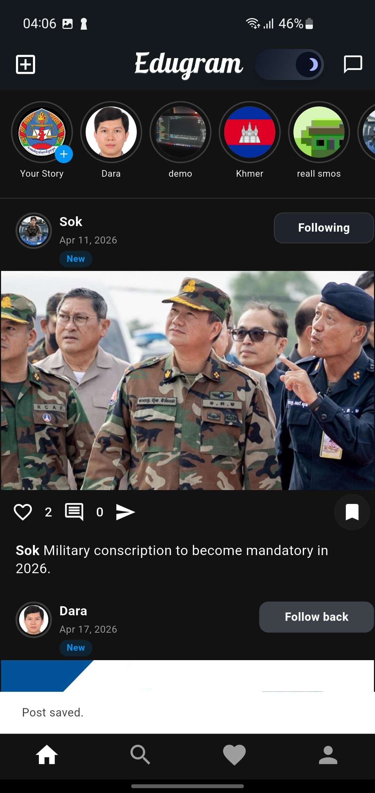&nbsp;
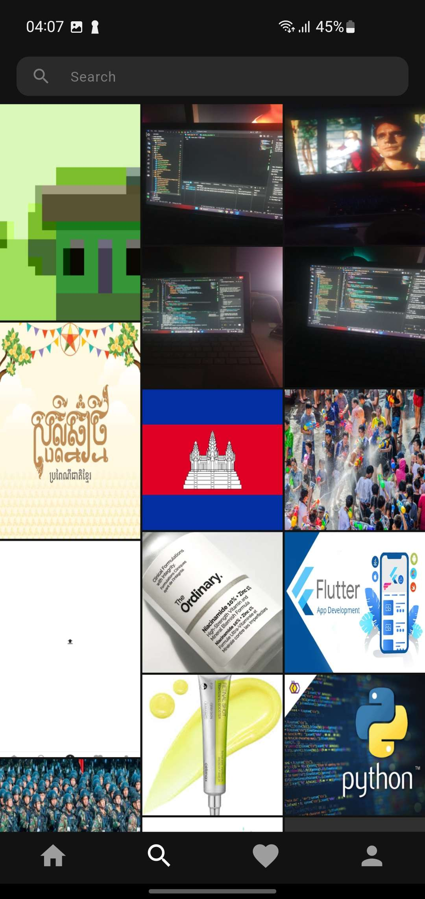&nbsp;
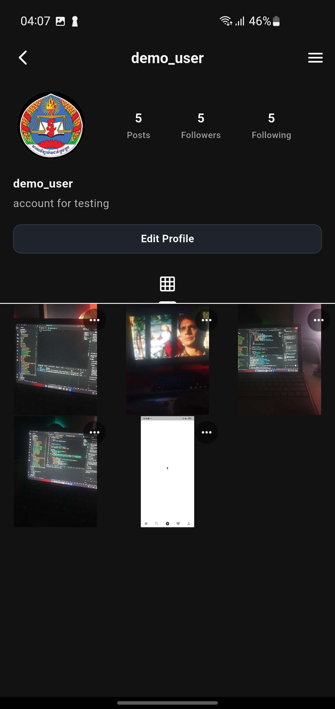

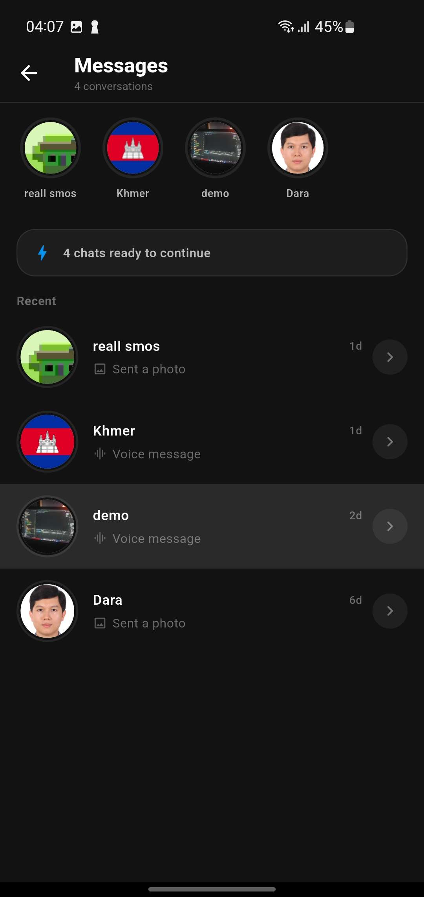&nbsp;
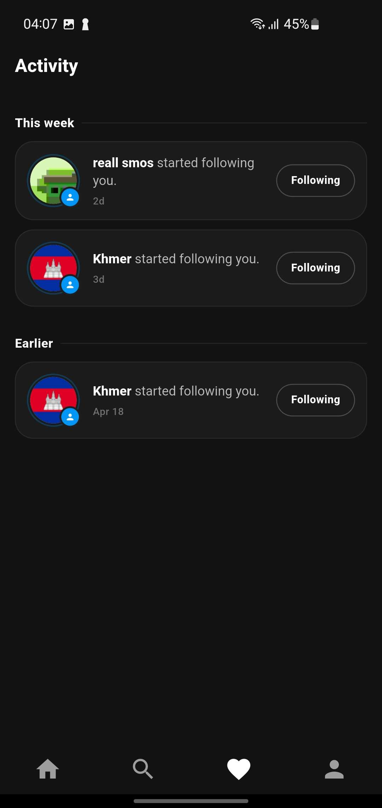&nbsp;
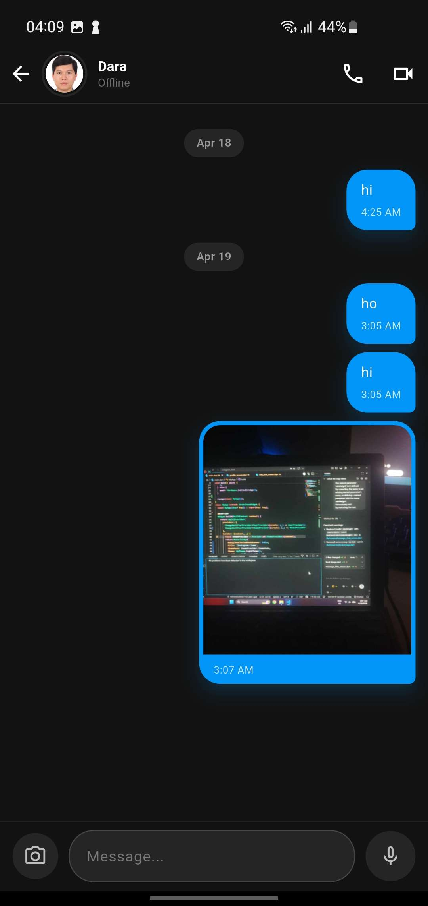

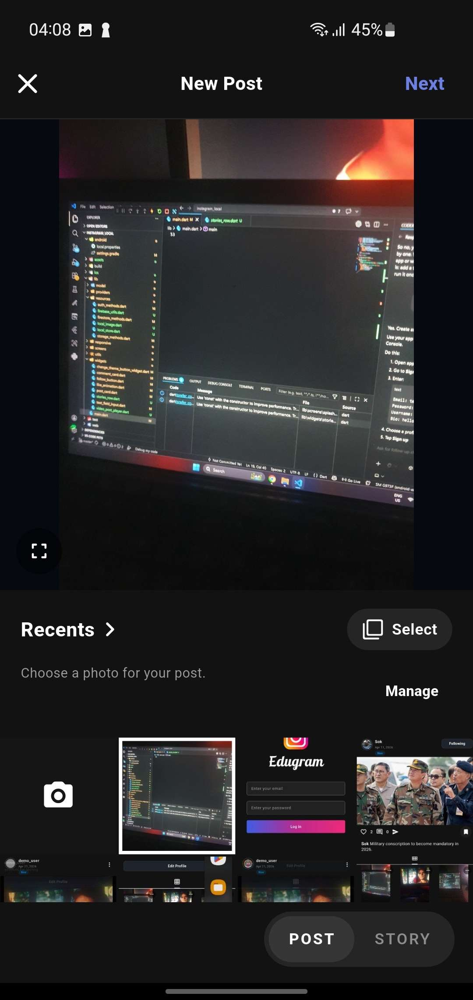&nbsp;
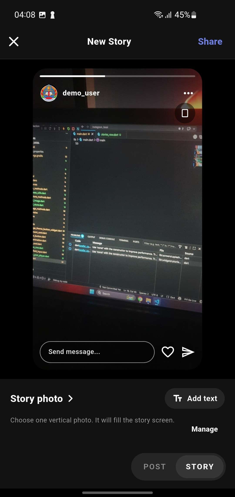&nbsp;
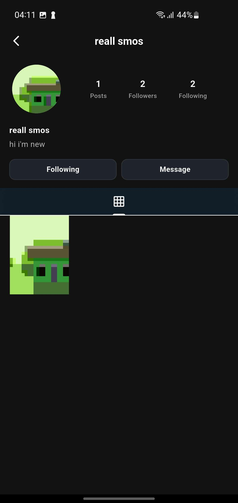


## Installation
Clone the repository and move into the project folder:

```bash
  git clone https://github.com/NovaRatanaAI/Edugram.git
  cd Edugram
  flutter pub get
```

Set up Firebase before running the app:

- Create a Firebase project
- Enable Firebase Authentication
- Set up Cloud Firestore and Firebase Storage
- Register your Android, iOS, and Web apps in Firebase
- Add the required Firebase config files and update `lib/firebase_options.dart`
- Make sure your Android/iOS app IDs in Firebase match your local app configuration

Run the app on your preferred platform:

```bash
  flutter run
```

Examples:

```bash
  flutter run -d chrome
  flutter run -d windows
  flutter run -d android
```

## Tech Used
**Server**: Firebase Auth, Firebase Storage, Firebase Firestore

**Client**: Flutter, Provider

## Repository
https://github.com/NovaRatanaAI/Edugram 

## Developed By 
 - Heng Ratana
 - Chay Chantha
 - Bon Chanthy
 - Sea Sereyvathana
